# Agentify — System Architecture

## Overview

Agentify is a multi-agent AI platform with a **React frontend** and a **FastAPI backend**. Each agent is independently accessible via REST endpoints and uses a combination of AI models and external APIs to perform its task.

---

## Architecture Diagram

```mermaid
flowchart TD
    User(["👤 User"])

    subgraph Frontend["🖥️ Frontend — React + Vite (Port 5173)"]
        Login["LoginModal (rohit / 123)"]
        Home["HomePage.jsx"]
        EmailUI["MailAutomation.jsx"]
        SocialUI["PostCreator.jsx"]
        WebUI["WebsiteBuilder.jsx"]
        LeadUI["LeadFinder.jsx"]
        AnalyticsUI["ResponseAnalytics.jsx"]
        SVC["unifiedAgentService.js (axios)"]
    end

    subgraph Backend["⚙️ Backend — FastAPI (Port 5000)"]
        Router["main.py (Router + CORS)"]

        subgraph EmailAgent["📧 Email Agent"]
            EG["email_generator.py"]
            ES["email_sender.py"]
            EP["email_poller.py"]
            CSV["simple_csv_email_agent.py"]
        end

        subgraph SocialAgent["📱 Social Media Agent"]
            SPA["social_post_agent.py"]
            IGP["instagram_poster.py"]
        end

        subgraph WebAgent["🌐 Website Builder Agent"]
            MR["model_runner.py"]
        end

        subgraph LeadAgent["🔍 Lead Finder Agent"]
            GEO["get_area_id()"]
            CRAWL["extract_emails_from_url()"]
        end

        SCHED["APScheduler (background jobs)"]
    end

    subgraph AIModels["🧠 AI Models"]
        G25F["Gemini 2.5 Flash"]
        G20F["Gemini 2.0 Flash (fallback)"]
        GIMG["Gemini Image Model"]
        GPT4["GPT-4o-mini (optional)"]
        FLUX["FLUX.1-schnell (via Gradio)"]
        SDXL["SDXL-Flash (via Gradio)"]
        POLL["Pollinations.ai"]
    end

    subgraph ExternalAPIs["🔌 External APIs"]
        SMTP["Gmail SMTP\nsmtp.gmail.com:587"]
        GMAILAPI["Gmail API v1\n(OAuth reply polling)"]
        TWITTER["Twitter API v2\n(Tweepy)"]
        INSTAGRAM["Instagram Web\n(Playwright Browser)"]
        OVERPASS["Overpass API\n(OpenStreetMap)"]
        NOMINATIM["Nominatim API\n(Geocoding)"]
        PHOTON["Photon API\n(Geocoding fallback)"]
    end

    subgraph Storage["💾 Local Storage"]
        CACHE["In-Memory csv_cache dict"]
        CSVFILES["audience_csv/*.csv"]
        COOKIES["ig_cookies.json"]
        TOKENS["token.json / service_account.json"]
    end

    User --> Login --> Home
    Home --> EmailUI & SocialUI & WebUI & LeadUI & AnalyticsUI
    EmailUI & SocialUI & WebUI & LeadUI --> SVC
    SVC --> |"POST /email/generate\nPOST /email/send\nPOST /send-bulk-email"| Router
    SVC --> |"POST /social/generate\nPOST /social/generate-image\nPOST /social/post"| Router
    SVC --> |"POST /generate"| Router
    SVC --> |"GET /generate-leads"| Router

    Router --> EG --> G25F
    Router --> ES --> SMTP
    EP --> GMAILAPI
    Router --> CSV --> CACHE
    CSV --> CSVFILES
    SCHED --> EP

    Router --> SPA
    SPA --> G25F
    SPA --> POLL
    SPA --> FLUX
    SPA --> SDXL
    SPA --> GIMG
    SPA --> TWITTER
    SPA --> IGP --> INSTAGRAM
    IGP --> COOKIES
    EP --> TOKENS

    Router --> MR
    MR --> G25F
    MR --> G20F
    MR --> GPT4

    Router --> GEO
    GEO --> NOMINATIM
    GEO --> PHOTON
    Router --> OVERPASS
    Router --> CRAWL
```



---

## Component Summary

| Component | Technology | Role |
|---|---|---|
| Frontend | React 19 + Vite + Tailwind | User interface |
| Backend | FastAPI + Uvicorn | API server + agent orchestration |
| HTTP Client | Axios | Frontend → Backend communication |
| Scheduler | APScheduler | Background email polling & scheduling |

---

## Agent Summary

| Agent | File | AI Model | Key External APIs |
|---|---|---|---|
| Website Builder | `model_runner.py` | Gemini 2.5 Flash / GPT-4o-mini | None |
| Email Automation | `email_generator.py`, `email_sender.py` | Gemini 2.5 Flash | Gmail SMTP, Gmail API |
| Social Media | `social_post_agent.py`, `instagram_poster.py` | Gemini 2.5 Flash, FLUX, SDXL | Twitter API, Instagram Web |
| Lead Finder | `main.py` (inline) | None | Nominatim, Photon, Overpass |
| CSV Extractor | `simple_csv_email_agent.py` | None | None |

---

## Image Generation Fallback Chain

```
User requests image
       │
       ▼
1. Pollinations.ai (fastest, free)
       │ fail
       ▼
2a. FLUX.1-schnell via Gradio
       │ fail
       ▼
2b. SDXL-Flash via Gradio
       │ fail
       ▼
3. Gemini 2.5 Flash Image Model
       │ fail
       ▼
    Error returned
```

---

## Email Sending Flow

```
User submits email form
       │
       ▼
POST /email/generate → Gemini 2.5 Flash → returns email body + HTML preview
       │
       ▼
User edits and clicks Send
       │
       ▼
POST /email/send (immediate) OR /send-bulk-email (from CSV cache)
       │
       ▼
email_sender.py → Gmail SMTP → delivers to all recipients
       │
       ▼
APScheduler polls every 5 min → Gmail API reads replies
```

---

## Lead Finder Flow

```
User enters keyword + city
       │
       ▼
GET /generate-leads?keyword=dentist&city=Mumbai
       │
       ▼
get_area_id() → Nominatim API → (fallback) Photon API → returns city name
       │
       ▼
Overpass API (4 mirrors) → returns business nodes with tags
       │
       ▼
asyncio.gather() → crawls all business websites concurrently
       │
       ▼
regex extracts emails from HTML → verified leads returned to UI
```

---

## All Environment Variables

| Variable | Used In | Required? |
|---|---|---|
| `GEMINI_API_KEY` | All AI agents | ✅ Required |
| `OPENAI_API_KEY` | Website Builder (fallback) | ⚠️ Optional |
| `MODEL_TYPE` | Website Builder | ⚠️ Optional (`gemini` default) |
| `SENDER_EMAIL` | Email Agent | ✅ Required |
| `SENDER_PASSWORD` | Email Agent (SMTP) | ✅ Required |
| `GMAIL_TOKEN_PATH` | Email Poller | ⚠️ Optional |
| `GMAIL_CREDENTIALS_PATH` | Email Poller setup | ⚠️ Optional |
| `GOOGLE_SHEETS_CREDENTIALS_PATH` | Sheets integration | ⚠️ Optional |
| `SHEET_ID` | Sheets integration | ⚠️ Optional |
| `HUGGINGFACE_API_KEY` | Social Media (image gen) | ⚠️ Optional |
| `TWITTER_API_KEY` | Social Media | ✅ Required for Twitter |
| `TWITTER_API_SECRET` | Social Media | ✅ Required for Twitter |
| `TWITTER_ACCESS_TOKEN` | Social Media | ✅ Required for Twitter |
| `TWITTER_ACCESS_SECRET` | Social Media | ✅ Required for Twitter |
| `INSTAGRAM_USERNAME` | Social Media | ✅ Required for Instagram |
| `INSTAGRAM_PASSWORD` | Social Media | ✅ Required for Instagram |
| `PORT` | Backend server | ⚠️ Optional (default: 5000) |
